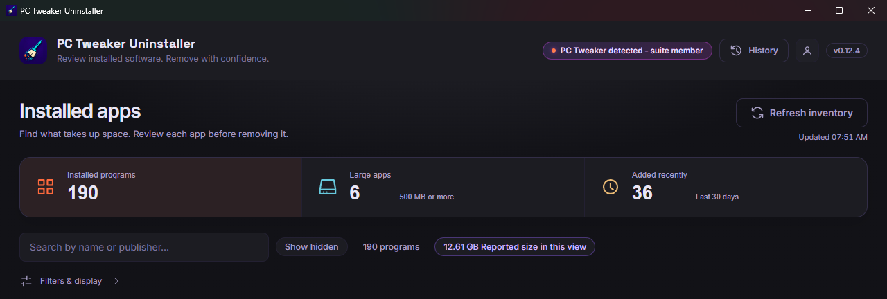

<p align="center">
  
</p>

<h1 align="center">PC Tweaker Uninstaller</h1>

<p align="center">
  <strong>Removal Intelligence for Windows.</strong><br>
  Remove software with clarity, not guesswork — part of the PC Tweaker suite.
</p>

<p align="center">
  <a href="https://pctweaker.app/uninstaller/"></a>
  <a href="https://github.com/AurelioAvila/pc-tweaker-uninstaller/blob/master/LICENSE"></a>
  <a href="https://github.com/AurelioAvila"></a>
  <a href="https://github.com/AurelioAvila/pc-tweaker-uninstaller/releases/latest"></a>
</p>

<p align="center"></p>

## Download

**[Official product page](https://pctweaker.app/uninstaller/)** — release status
and product information. Uninstaller shares a suite account with PC Tweaker,
with product-specific entitlements. A PC Tweaker license token cannot be used as
an Uninstaller license token. PC Tweaker Lifetime owners also have a
[documented 12-month Uninstaller Pro benefit](https://github.com/AurelioAvila/pc-tweaker-app#free-and-pro),
activated on first sign-in to Uninstaller with the same account. This is a
separate, time-limited entitlement, not a perpetual Uninstaller license.

**[Download latest signed version](../../releases/latest)** for Windows 10/11 x64.
The [0.12.1 setup EXE](../../releases/tag/v0.12.1) was checked on October 2, 2026:
its Authenticode signature identifies **Aurelio Avila** and includes a trusted timestamp.
Its SHA-256 is `68eec3ec4f79f99ec16d73e38d5c48baaae8a09b5cd904b4e211b9a719540764`.
This check applies to that specific setup EXE, not every asset or future build.
Historical version 0.8.2 remains unsigned; use current official downloads.

**WinGet status (October 2, 2026):** the latest stable release is 0.12.1. The [0.12.1 package submission](https://github.com/microsoft/winget-pkgs/pull/434135)
is awaiting manual review. Passing automated checks is not catalog approval.
Use the GitHub release download until the package is accepted.

Signing identifies the publisher and protects file integrity; neither code signing
nor WinGet guarantees the absence of SmartScreen warnings.

See the [signing inventory and verification guide](https://github.com/AurelioAvila/.github/blob/master/CODE_SIGNING.md).
Use official downloads and investigate security warnings before proceeding.

## What it does

Uninstall Windows programs cleanly, with a safety net. Every removal is explained before it runs and recorded after it finishes.

| | |
| --- | --- |
| **Removal Confidence Score** | Every program is rated Safe, Review or Keep, with the reasons spelled out. System components and runtimes other software depends on are flagged before you touch them. |
| **Removal Brief** | Before anything runs you see the exact command, the method (Windows Installer or the program's own uninstaller), the permissions it will ask for and the reported size. |
| **Related programs** | Programs installed inside another program's folder are named before you remove the parent, so a game library or plugin host does not take other software with it by surprise. |
| **Restore-point attempt** | Before elevated removals, the app attempts to create a Windows restore point and records the outcome. Creation can fail or be skipped; Windows settings, permissions and throttling affect availability. |
| **Leftover scan** | After the uninstall, the program's remaining folders, shortcuts and registry keys are listed. Protected system and personal folders are never offered. |
| **Removal Ledger** | A local receipt of what was removed, how, with what result and how much space was actually freed. Exportable, and it never leaves your PC. |
| **Store apps too** | Classic desktop software and Microsoft Store apps in one list, with search, filters, sorting and CSV export. |

6 languages (English, Italian, French, Spanish, German and Portuguese), 8 themes, and one suite account shared with PC Tweaker.

### Free and Pro

| Free | Pro |
| --- | --- |
| Unlimited single uninstalls, desktop and Store apps | Everything in Free |
| Confidence Score and Removal Brief for every program | **Leftover cleanup**: remove the files, folders and registry keys the scan finds. Files go to the Recycle Bin. |
| Restore-point attempt before elevated removals, with the outcome recorded | **Safe Batch**: queue several programs and let them run in sequence |
| Leftover scan and the Removal Ledger | |

See the [official product page](https://pctweaker.app/uninstaller/) for current plans.

## Architecture

- **Desktop app**: Tauri 2 (Rust core) + React 19 + TypeScript (strict).
- **Backend**: the shared PC Tweaker ecosystem backend (accounts, signed
  licenses, Stripe). This repo contains no server code and no secrets.
- **License model**: the backend signs `{userId, isPro, plan, product,
  issuedAt}` with an Ed25519 key; this client verifies the exact signed
  bytes with the embedded public key and additionally requires
  `product == "uninstaller"` — a valid PC Tweaker license does not unlock
  this app (see `src-tauri/src/license.rs`).
- **Safety model**: every reversible change is snapshotted before it is
  applied (`src-tauri/src/rollback.rs`, atomic writes + locking, ported
  with its tests from PC Tweaker). Privileged actions run one at a time
  through an explicit UAC consent (`src-tauri/src/elevation.rs`).

## Development

```
npm install
npm run tauri dev
```

Checks (all of these gate CI):

```
npm run build         # tsc --noEmit + vite build
npm run lint          # eslint (strict, type-checked)
npm run format:check  # prettier
cd src-tauri && cargo fmt --check && cargo clippy -- -D warnings && cargo test
```

Release maintainers: follow the [local signing and verification procedure](RELEASING.md).
Distribution must stop if publisher signing or timestamp verification fails.

## Legal

The source is published for review and transparency only — see
[LICENSE](LICENSE): no rights are granted to use, copy, modify, or
redistribute it. Use of the compiled application is governed by
[TERMS.md](TERMS.md); how data is handled is documented in
[PRIVACY.md](PRIVACY.md).

## Security notes

- No secrets in this repo; the signing private key exists only on the
  backend host. The embedded key here is the public (verify-only) half.
- Release builds never enable DevTools (see `src-tauri/Cargo.toml`).
- CSP allows network access exclusively to the ecosystem backend.

## Support

For support or billing questions, email [uninstaller@pctweaker.app](mailto:uninstaller@pctweaker.app). Include the app version and steps to reproduce the problem. Never send passwords, access tokens, private keys or payment card details, and remove sensitive information from screenshots and logs.

